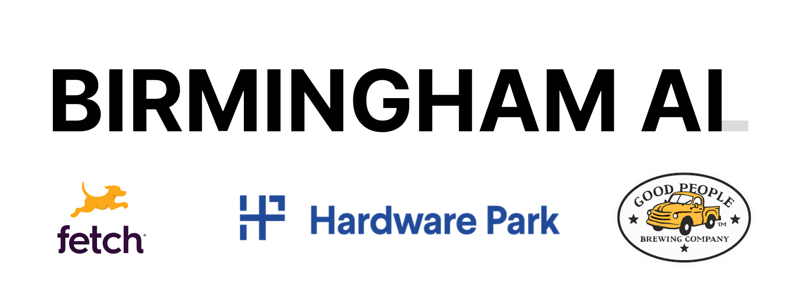

# Running LLMs Locally

#### Why you'd want to and how you'd go about it

---

# Who are we?

Birmingham AI

- Big group (loads of backgrounds)
- Smaller group (engineer types)
- My name's Rob, I'm a senior engineer @ [Hasura](https://hasura.io/)

---

---

# Today's agenda

1. 🎁 The winner of our $50 gift card to GPBC
2. 🤗 Why local models over turnkey LLMs
3. 🏗️ Considerations when running these locally

---

# So, we had a hackathon...!

#### Our `conversation-partner` API needed a client...

---

# And, the winner is...

---

# TBD!

Congratulations! Grab your prize and walk us through your solution 🎉

---

# Why local models over turnkey LLMs?

---

---

---

# Foundational models

- GPT
- BERT
- Mistral

---

# Foundational models

- These are a starting place
- From here, we can fine-tune
- We can then deploy these ourselves, or use hosted solutions

---

# What does it mean to fine-tune?

- Essentially, "teach" a complex model to do a specific task.
- Typically done through reinforcement learning.

---

# I really wish there was an open-source option for this...

## 🤗

---

# Hugging Face

- GitHub, but for models 🎉

---

# Deployment

- `Spaces` allow you to host demos of ML apps
  - Obviously, not ideal for real-world use cases
- Use an off-the-shelf rack?
- Hosted options [like GCP's Vertex AI](https://cloud.google.com/vertex-ai/docs/start/introduction-unified-platform),
  [Azure OpenAI](https://learn.microsoft.com/en-us/azure/ai-services/openai/how-to/create-resource?pivots=web-portal), etc.

---

# Dr. Mamidi: Or How I Learned To Stop Worrying and Not Turn My Computer into a Bomb

<!-- TODO: Tarun and Yash: add your info here and any other slides before the wrap-up! -->

---

# Wrapping up

- Sloss.tech: x2 panels on AI! Tickets [available here](https://www.sloss.tech/).

- Upcoming meetings

  - June: Building an AI-powered trivia game (Paul R.)
  - July: 🌴 😎
  <!-- TODO: Add information about Wookie's HubSpot presentation -->
  - August: (Wookie)
  - September: Building AI applications with no-code tools (Tarun)

---

# We need YOU!

